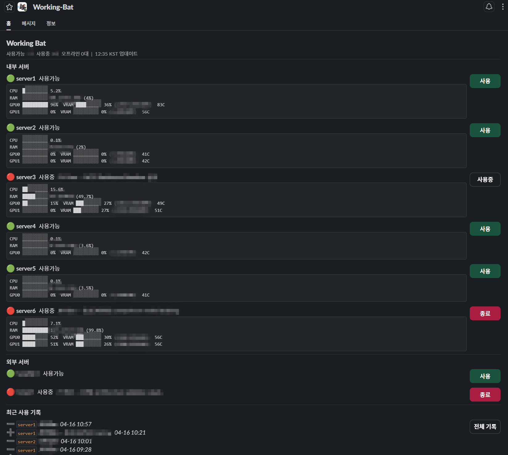

<div align="center">

# 🦇 Working Bat

**Slack-based GPU/CPU server usage management bot**

[](./LICENSE)


**[Guidance (EN)](#english-guide) · [가이드 (KO)](#korean-guide)**

</div>

---



---

## Features

- **Real-time monitoring** — CPU, RAM, GPU utilization with progress bars, updated every 10s
- **Server reservation** — Reserve / release servers via buttons or slash commands
- **Usage history** — Full log with KST timestamps, searchable by server
- **Multi-group support** — Separate internal (with metrics) and external (without agent) servers
- **Slack Home tab** — Live dashboard, compact and at-a-glance
- **Lightweight** — SQLite + Node.js bot + Python agent per server

---

## How It Works

```
Each server                          Bot server (any machine)
┌─────────────────┐    HTTP POST    ┌──────────────────────┐
│   agent.py      │ ─────────────► │   app.js (Bolt)      │
│  (metrics)      │  /metrics       │   SQLite DB          │
└─────────────────┘                 │   Slack Home UI      │
                                    └──────────────────────┘
```

---

## Commands

| Command | Description |
|---|---|
| `/server status` | All servers with live metrics |
| `/server who` | Currently in-use servers |
| `/server free` | Available servers |
| `/server use <id> [memo]` | Reserve a server |
| `/server done <id>` | Release a server |
| `/server log [id]` | Usage history |
| `/server db` | DB stats |

---

## Setup Guide

<a name="english-guide"></a>
<details>
<summary><b>English — Full Setup Guide (A–Z)</b></summary>

<br>

### Requirements

- Node.js 18+, Python 3.8+, PM2 (`npm i -g pm2`)
- `apt install python3 make g++` (for better-sqlite3)

---

### 1. Create Slack App

**1-1.** Go to [api.slack.com/apps](https://api.slack.com/apps) → **Create New App** → **From scratch**  

**1-2. Enable Socket Mode**  
`Settings` → `Socket Mode` → Enable → Generate App-Level Token (scope: `connections:write`)
→ Save as `SLACK_APP_TOKEN` (`xapp-...`)

**1-3. Add OAuth Scopes**  
`Features` → `OAuth & Permissions` → `Bot Token Scopes`

| Scope | Purpose |
|---|---|
| `chat:write` | Send ephemeral messages |
| `users:info` | Resolve display names |
| `app_mentions:read` | — |

**1-4. Enable App Home**  
`Features` → `App Home` → **Home Tab** ✅

**1-5. Subscribe to Events**  
`Features` → `Event Subscriptions` → Enable → Add bot event: `app_home_opened`

**1-6. Add Slash Command**  
`Features` → `Slash Commands` → **Create New Command**

| Field | Value |
|---|---|
| Command | `/server` |
| Request URL | `https://placeholder.example.com` (unused in Socket Mode) |

**1-7. Install to Workspace**  
`Settings` → `Install App` → **Install to Workspace**
→ Copy **Bot User OAuth Token** → `SLACK_BOT_TOKEN` (`xoxb-...`)

**1-8. Collect All Tokens**  

| Variable | Location |
|---|---|
| `SLACK_BOT_TOKEN` | OAuth & Permissions → Bot User OAuth Token |
| `SLACK_SIGNING_SECRET` | Basic Information → App Credentials |
| `SLACK_APP_TOKEN` | Basic Information → App-Level Tokens |

---

### 2. Bot Server

```bash
git clone https://github.com/Jonghwan-dev/working-bat.git
cd working-bat
npm install
cp .env.example .env
vi .env   # fill in tokens + set METRICS_SECRET to any random string
```

Edit server list in `db.js` if needed (default: server1–6 internal, koran1/hanshin1 external).

Start:
```bash
pm2 start ecosystem.config.js
pm2 save && pm2 startup
```

---

### 3. Agent (per server)

```bash
# copy files to each server
scp agent.py agent.config.example user@<server-ip>:~/agent/

# on each server
cd ~/agent
cp agent.config.example agent.config
vi agent.config
```

```ini
[agent]
server_id = server1           # must match db.js
url       = http://<bot-server-ip>:3000/metrics
token     = <same as METRICS_SECRET>
interval  = 10
```

**Run as systemd service:**  
```bash
sudo cp agent.service.example /etc/systemd/system/server-agent.service
sudo vi /etc/systemd/system/server-agent.service   # set User and WorkingDirectory
sudo systemctl daemon-reload
sudo systemctl enable --now server-agent
```

---

### 4. Update  

```bash
git pull && pm2 restart working-bat
```

</details>

---

<a name="korean-guide"></a>
<details>
<summary><b>한국어 — 전체 설치 가이드 (A–Z)</b></summary>

<br>

### 사전 준비  

- Node.js 18+, Python 3.8+, PM2 (`npm i -g pm2`)
- `apt install python3 make g++` (better-sqlite3 빌드용)

---

### 1. Slack 앱 생성  

**1-1.** [api.slack.com/apps](https://api.slack.com/apps) → **Create New App** → **From scratch**

**1-2. Socket Mode 활성화**  
`Settings` → `Socket Mode` → 활성화 → App-Level Token 생성 (scope: `connections:write`)
→ `SLACK_APP_TOKEN` (`xapp-...`)으로 저장

**1-3. OAuth 스코프 추가**  
`Features` → `OAuth & Permissions` → `Bot Token Scopes`

| Scope | 용도 |
|---|---|
| `chat:write` | 에페메럴 메시지 전송 |
| `users:info` | 사용자 이름 조회 |
| `app_mentions:read` | — |

**1-4. App Home 활성화**  
`Features` → `App Home` → **Home Tab** ✅

**1-5. 이벤트 구독**  
`Features` → `Event Subscriptions` → 활성화 → bot event 추가: `app_home_opened`

**1-6. 슬래시 명령어 추가**  
`Features` → `Slash Commands` → **Create New Command**

| 항목 | 값 |
|---|---|
| Command | `/server` |
| Request URL | `https://placeholder.example.com` (Socket Mode에서 미사용) |

**1-7. 워크스페이스 설치**  
`Settings` → `Install App` → **Install to Workspace**
→ **Bot User OAuth Token** 복사 → `SLACK_BOT_TOKEN` (`xoxb-...`)

**1-8. 토큰 정리**  

| 환경변수 | 위치 |
|---|---|
| `SLACK_BOT_TOKEN` | OAuth & Permissions → Bot User OAuth Token |
| `SLACK_SIGNING_SECRET` | Basic Information → App Credentials |
| `SLACK_APP_TOKEN` | Basic Information → App-Level Tokens |

---

### 2. 봇 서버  

```bash
git clone https://github.com/Jonghwan-dev/working-bat.git
cd working-bat
npm install
cp .env.example .env
vi .env   # 토큰 4개 + METRICS_SECRET 임의 문자열 입력
```

필요시 `db.js`의 서버 목록 수정 (기본값: server1–6 내부, koran1/hanshin1 외부).

실행:
```bash
pm2 start ecosystem.config.js
pm2 save && pm2 startup
```

---

### 3. 에이전트 (서버별)

```bash
# 각 서버로 파일 전송
scp agent.py agent.config.example user@<서버IP>:~/agent/

# 각 서버에서
cd ~/agent
cp agent.config.example agent.config
vi agent.config
```

```ini
[agent]
server_id = server1           # db.js에 등록된 ID와 일치해야 함
url       = http://<봇서버IP>:3000/metrics
token     = <METRICS_SECRET과 동일>
interval  = 10
```

**systemd 서비스로 등록:**  
```bash
sudo cp agent.service.example /etc/systemd/system/server-agent.service
sudo vi /etc/systemd/system/server-agent.service   # User, WorkingDirectory 수정
sudo systemctl daemon-reload
sudo systemctl enable --now server-agent
```

---

### 4. 업데이트

```bash
git pull && pm2 restart working-bat
```

</details>

---

## License

[MIT](./LICENSE)
